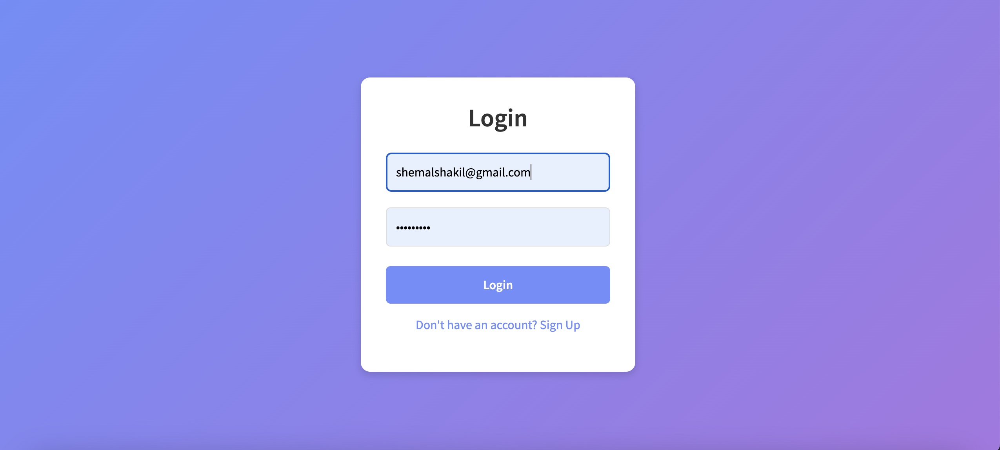
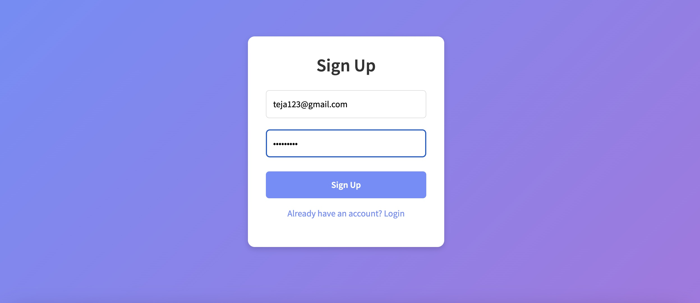
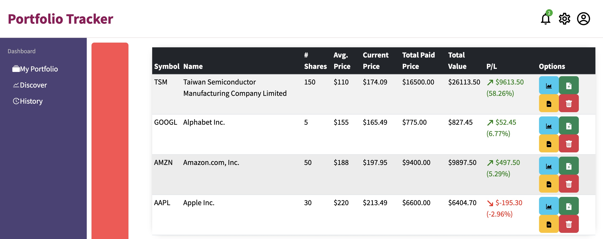
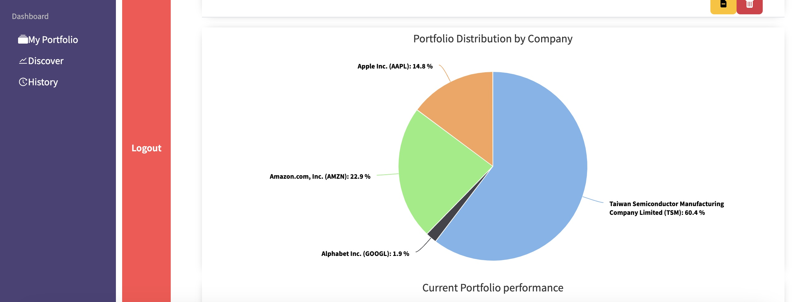
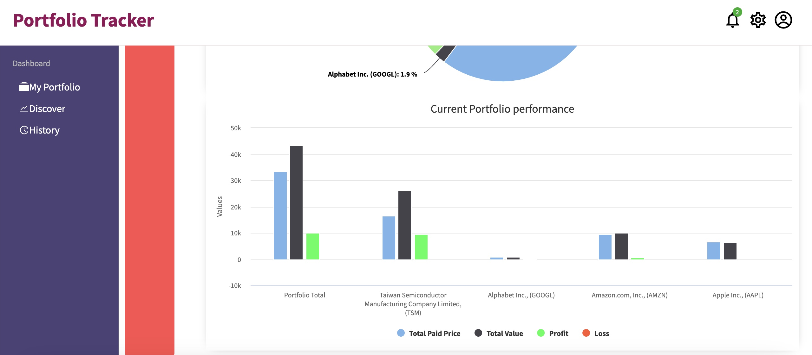
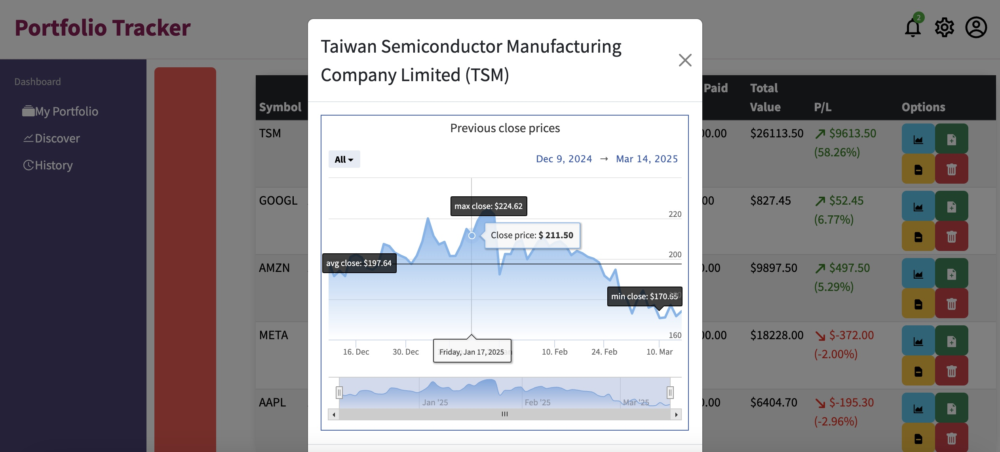
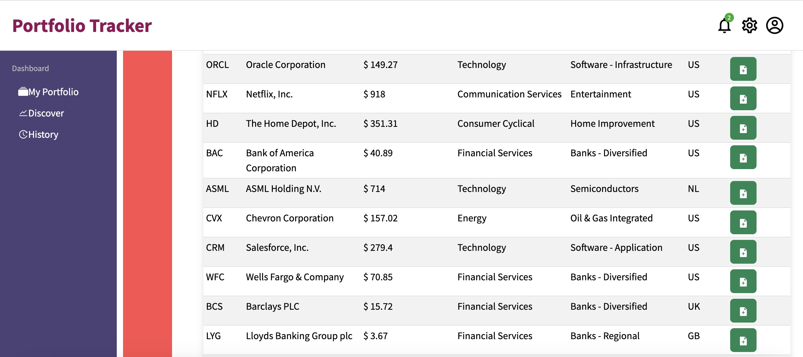

# 📊 StockTracker - Real-Time Financial Data Processing & Trading Engine 🚀  

## 🏆 **Overview**  
StockTracker is a **real-time financial data processing platform** that allows users to track stock & crypto prices, execute trades, and analyze market trends using AI-powered insights. Built with a **microservice-based architecture**, it ensures **high-performance** order execution and risk evaluation in real time.  

---

## ⚙️ **Tech Stack**
### 🏠 **Backend**
- 🟢 **Node.js (Express.js)** - API & microservices  
- 🔵 **PostgreSQL + TimescaleDB** - Database & time-series data  
- 🔥 **Redis** - Real-time order book caching  
- 🔄 **WebSockets (Socket.io)** - Live market updates  

### 🖥 **Frontend**
- ⛏ **React.js (Next.js)** - UI with SSR for fast performance  
- 🎨 **TailwindCSS** - Modern & responsive design  

---

## 🔐 **Features**
### 🏦 **Financial Market Tracking**
✅ Real-time stock & crypto data via **Alpaca/Binance API**  
✅ WebSocket-based **live order book synchronization**  
✅ Customizable **market alerts** for price thresholds  

### 📈 **Trading & Order Matching**
✅ **FIFO Order Matching Engine (OME)** built using WebSockets  
✅ Support for **limit orders, market orders, stop-loss orders**  
✅ Redis-based **high-speed transaction processing**  

### 🔍 **Market Insights & AI Analysis**
✅ Real-time **financial analytics & predictive modeling**  
✅ AI-based **risk assessment & portfolio optimization**  

### 🔒 **Security & Authorization**
✅ **JWT Authentication** with OAuth (Google, GitHub)  
✅ **Role-Based Access Control (RBAC)** (Admin, Trader, Analyst)  
✅ API Gateway with **mTLS authentication**  

---

## 🚀 **How to Run the Project Locally**
### ⚙️ **1️⃣ Install Dependencies**
```sh
  git clone https://github.com/your-repo/StockTracker.git
  cd StockTracker
  npm install
```

### ▶ **2️⃣ Run the Backend**
```sh
  cd backend
  npm run dev
```

### 🌍 **3️⃣ Start the Frontend**
```sh
  cd frontend
  npm run dev
```
Access the app at **http://localhost:3000** 🎉  

---

## 🛥 **Deploying to AWS**
### ☁ **1️⃣ Deploy Backend on AWS Lambda**
1. Zip your backend code:  
   ```sh
   zip -r backend.zip . -x "node_modules/*"
   ```
2. Upload the ZIP to **AWS Lambda**  
3. Expose via **API Gateway**  

### 🚀 **2️⃣ Deploy Frontend on Vercel**
1. Connect the repo to [Vercel](https://vercel.com/)  
2. Click **Deploy** & get a live URL  

---

## 📌 **Project Structure**
```plaintext
StockTracker/
│── backend/       # Node.js backend with Express
│── frontend/      # React.js + Next.js UI
│── infra/         # AWS Terraform/CDK scripts
│── services/      # Microservices (Trading, Analytics)
│── README.md      # Project Documentation 📚
```

---

## 📊 **API Endpoints**
### 🔑 **Authentication**
- `POST /api/auth/signup` - User Signup  
- `POST /api/auth/login` - User Login  

### 📉 **Market Data**
- `GET /api/market/stocks` - Fetch stock prices  
- `GET /api/market/crypto` - Fetch crypto prices  

### 📈 **Trading**
- `POST /api/orders` - Place an order  
- `GET /api/orders/:id` - Get order details  

---

## 🎥 **Demo Video & Screenshots**
📌 **[Watch Demo Here](#)**  
[Watch Demo Video Here]([https://link-to-your-video](https://share.vidyard.com/watch/2JDNEXr7z8NF3r2xzQ5zrk))
🖼️ Screenshots available in `docs/screenshots/`  

### Login


### SignUp


### Dashboard


### Portfolio Shares Distribution Graph


### Bar Graph Demonstrating Investments


### TimeSpan Graph of Stocks


### Realtime Stock Data using Alpha Vantage APIs


---

## 🤝 **Contributing**
1. **Fork the repository**  
2. **Create a feature branch** (`feature-new`)  
3. **Commit changes** & open a **Pull Request**  

---

---

## 💬 **Need Help?**
📩 **Contact**: shemalshakil7128@gmail.com  


---

🚀 **Let’s build the future of financial trading together!** 🚀

